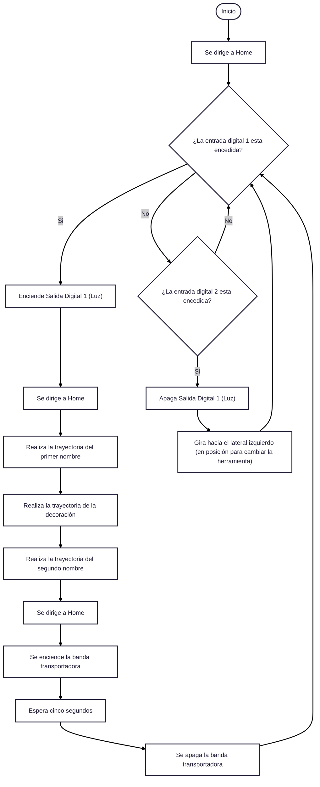

# Laboratorio No. 02 - Robótica Industrial - Trayectorias, Entradas y Salidas Digitales.
## Descripción de la solución planteada 

## Diseño del porta-herramienta

El porta herramienta se diseño con un angulo de 40º para evitar una singularidad. Además se creo considarando las medidas de un marcador borrable EXPO y un resorte encontrado en casa, de una pulgada de longitud con diametro de media pulgada, que tiene el proposito de amortiguar. 

## Trayectorias

## Diagrama de Flujo

## Plano de Planta

La caja se encuentra ubicada en X=675 mm; Y=110 mm y Z=195 mm con la base del robot como referencia.
La altura de la banda corresponde a Z=195 mm y la longitud es de 400 mm.

## Funciones utilizadas
* MoveJ:
  Desplazamiento del extremo del robot hasta el punto indicado sin garantizar la trayectoria seguida.
  Se utilizo principalmente para llevar el robot desde su ultima posición a la posición de Home.
  
* MoveL:
  Desplazamiento del extremo del robot hasta el punto indicado siguiendo una línea recta.
  Se utilizo para mover el robot en los puntos pertenecientes a las trayectorias de los nombres y la decoración.

## Video con Simulaciones y Práctica Real
