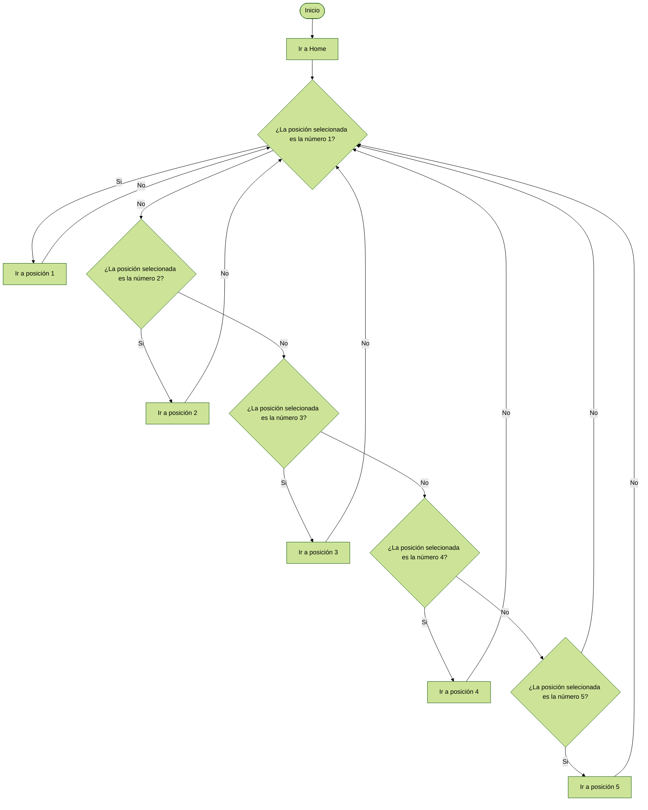

# Laboratorio No. 4 - Cinemática Directa - Phantom X - ROS
## Objetivos
- Crear todos los Joint Controllers con ROS para manipular servomotores Dynamixel AX-12 del robot Phantom X Pincher.
- Manipular los tópicos de estado y comando para todos los Joint Controllers del robot Phantom X Pincher.
- Manipular los servicios para todos los Joint Controllers del robot Phantom X Pincher.
- Conectar el robot Phantom X Pincher con Python usando ROS 2.
## Cinemática Directa

Con base en los sistemas coordenados planteados en la imagen anterior, se obtiene la tabla de parámetros del robot Phantom X:

| Link  | θi | di | ai |  αi  |  Offset  |
| ------------- | ------------- | ------------- | ------------- | ------------- | ------------- |
| 1  | θ1  | L1 | 0 | -π/2 | 0 |
|  2|  θ2 | 0 | L2 | 0 | -π/2 |
|  3|  θ3 | 0 | 3 | 0 | π/2 |
|  4|  θ4 | 0 | 4 | 0 | π/2 |

### Longitudes

Las longitudes referidas en la cinemática directa son:
| Longitud  | [m] |
| ------------- | ------------- |
| L1  |   |
| L2  |   |
| L3  |   |
| L4  |   |

### Diagrama del robot con software

## Implementación
### Descripción de Solución Planteada
### Plano de planta (Fisica)
### Funciones utilizadas
### Diagrama de Flujo

### Evidencias fotograficas

### Interfaz

## Video 
