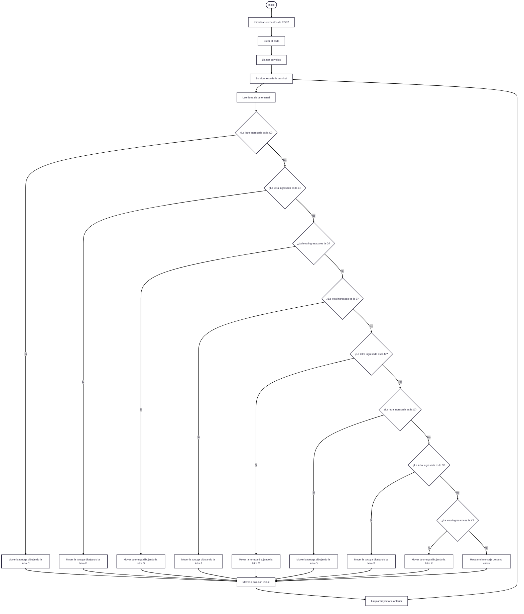
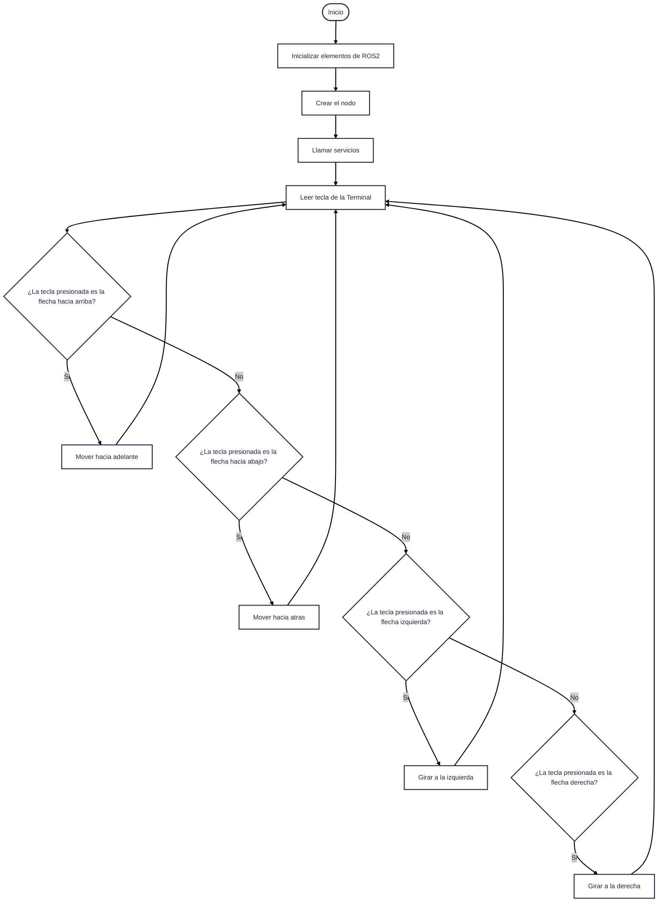

# Laboratorio No. 01 - 2025-I - Robótica de Desarrollo, Intro a ROS 2 Humble - Turtlesim
## Objetivos.
Para el desarrollo del laboratorio se plantean los siguientes objetivos iniciales:

1. Conocer y explicar los conceptos básicos de ROS (Robot Operating System).
2. Usar los comandos fundamentales de Linux.
3. Conectar nodos de ROS 2 con Python.

 Una vez cumplidos estos objetivos, se desarrollarán dos actividades orientadas a consolidar y aplicar los conocimientos adquiridos. La primera actividad consiste en implementar el control del movimiento de la tortuga del simulador turtlesim a través del teclado. La segunda actividad tiene como finalidad programar el trazado automático de letras personalizadas utilizando dicho simulador.

## Procedimientos realizados.
Se 

## Decisiones de diseño.
En la primera actividad, se establece un ángulo de 0.18 radianes y una velocidad de 0.3 , considerando que el tiempo de ejecución es breve. Esta configuración permite que el cambio en el movimiento de la tortuga sea perceptible, pero lo suficientemente sutil como para mantener un desplazamiento controlado. De esta manera, se logra una mayor precisión en la trayectoria, facilitando la generación de formas más definidas durante la simulación.

En la segunda actividad, se opta por limitar el tiempo de ejecución de cada trazo y ajustar las velocidades. Asimismo, se decide realizar el trazado de las letras utilizando únicamente líneas rectas. Esta elección responde al hecho de que no se emplean coordenadas absolutas y el ángulo de orientación puede presentar variaciones (en el orden de milésimas) en cada ejecución. El uso de curvas acentuaría dichas desviaciones, haciendo más notoria la inclinación no deseada en el trazado. 


## Funcionamiento general del proyecto.


Para la actividad que implica el dibujar letras personalizadas, se plantea el siguiente diagrama de flujo, las letras elegidas son "C,E,G,J,M,O,S,X" correspondientes a las iniciales de los nombres y apellidos de los integrantes del grupo. 





Para la actividad asociada a controlar la tortuga del simulador turtlesim con las flechas del teclado se palntea el diagrama de flujo a continuación:




Para la ejecución del código, se debe tener el archivo de Python en la ubicación correspondiente en el proyecto y ejecutar las siguientes lineas de código en la terminal:
```
source /opt/ros/humble/setup.bash
ros2 run turtlesim turtlesim_node
```
En otra terminal se debe ejecutar: 
```
source /opt/ros/humble/setup.bash
colcon build
source install/setup.bash
ros2 run my_turtle_controller move_turtle
```


